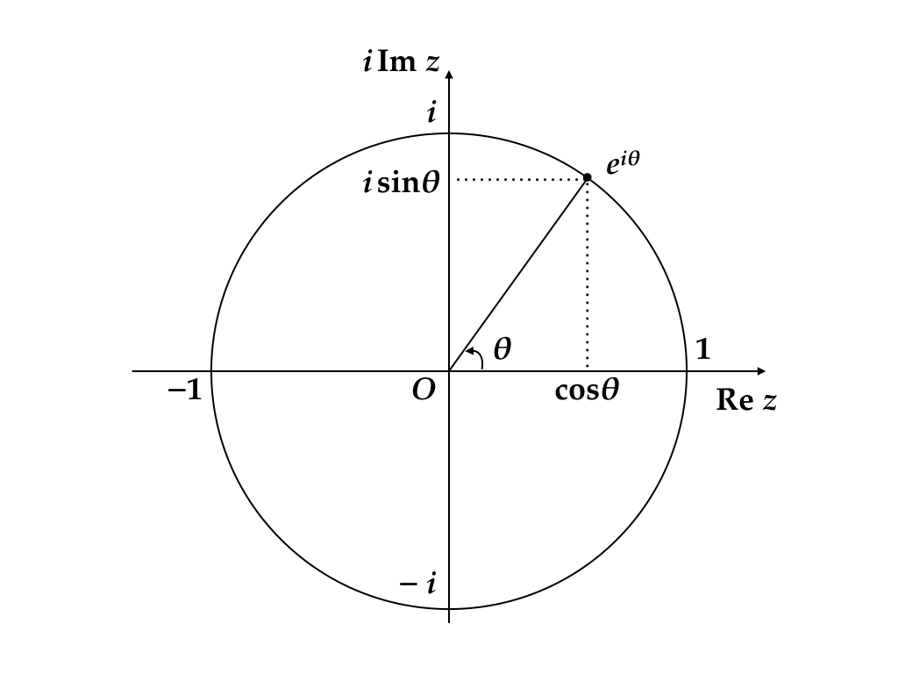
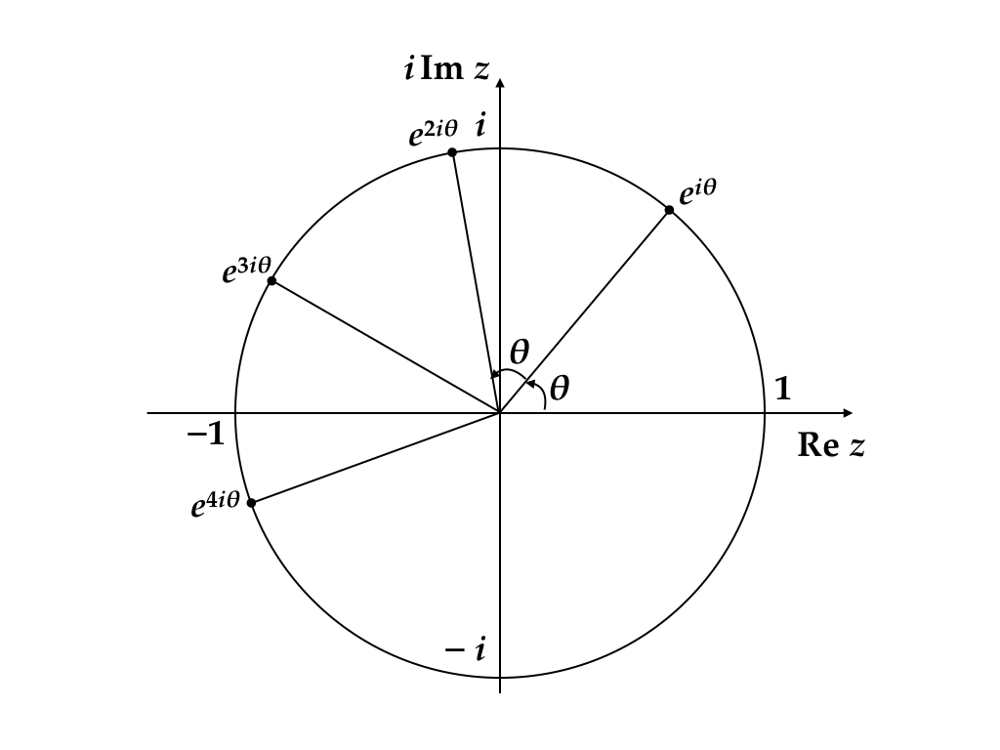
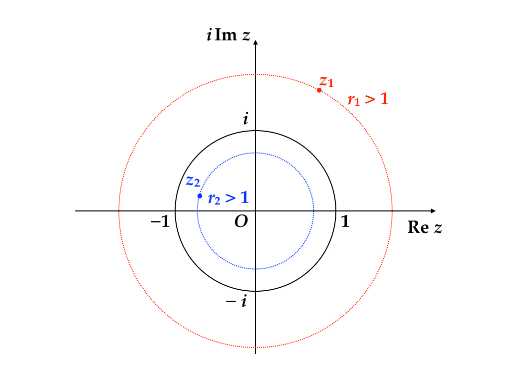
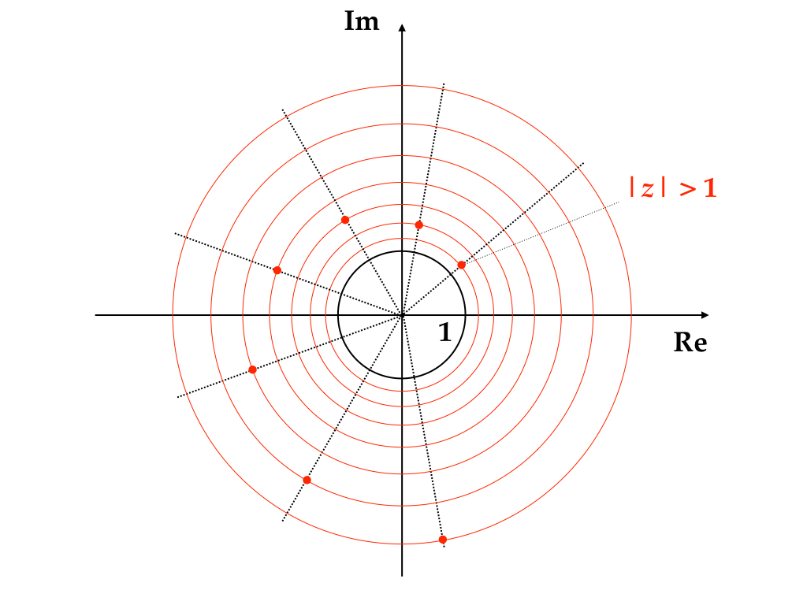
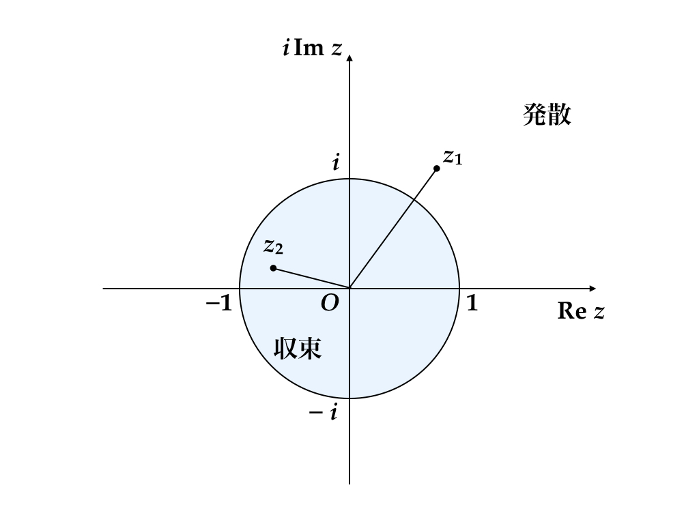

```{r setup, include=FALSE}
source("../R/utils.R")
knitr::opts_chunk$set(
  fig.align = "center",
  out.height = "380px",
  dpi = 180
)
```

## 宿題 / Homework Assignment

HW02 or HW02j or both  
Visit https://github.com/rokko-ed17q1/hw-portal

> Due 2017-04-16 18:00.  
> Hand in by Pull Request.  
> Read the handout for details!

If you have any problems start discussions on Slack.  
https://rokkoecon-slack-invite.herokuapp.com/ 

---

`r section("Complex Numbers")`

---

## 複素数（complex numbers）

動学理論を理解するには複素数に関する最低限の理解は必須である。

経済数学の教科書では複素数の解説を省くことも多いようなので，基本事項を簡単に解説する。

西村和雄（1982）『経済数学早わかり』は重要な例外である（この本が高校数学で微分方程式を教えていた時代に書かれたものであり，今の経済学部生にはやや難しいかもしれない）


---

## 動学理論と複素数の関係

実例を見てみよう。次のような $2 \times 2$ 行列 $A$ を考える。

$$A = 0.8 \times 
\begin{bmatrix}
  0.8660254... & -0.5000000...  \\
  0.5000000... &  0.8660254... 
\end{bmatrix}$$

$x_0 = \begin{bmatrix} 1 \\ 0 \end{bmatrix}$ として，

$$x_n = A x_{n-1} = \cdots = A^n x_0$$

を計算してみよう。**行列を繰り返し掛ける操作は動的システムの時間発展を表現する数学の基本である**

---

## R の行列

```{r a-matrix, include = FALSE}
theta = pi / 6
A = 0.8 * matrix(c(cos(theta), -sin(theta), 
                   sin(theta), cos(theta)), 
                 nrow = 2, byrow = TRUE)
```

行列 $A$ を次のように定義する。どのように定義したかは後ほど説明する。 


```{r}
A
```


---

## 初期値ベクトル

初期値ベクトルは次のように書ける。

$$x_0 = \begin{bmatrix} 1 \\ 0 \end{bmatrix}$$

```{r}
x = matrix(c(1, 0))
x
```

---

## 可視化

R で可視化（visualization）をする場合の基本関数は `plot()` であるが，今日は `ggplot2::qplot()` を使おう。

```{r}
library(ggplot2)
theme_set(theme_bw(base_size = 22))
```

---

## 可視化（cont'd）

```{r}
qplot(x[1], x[2], geom = 'point', size = I(4))
```


---

## 行列積

行列の掛け算は，演算子 `%*%` を使う。

```{r, out.height='300px'}
x1 = x
x2 = A %*% x1
X = rbind(t(x1), t(x2))
qplot(X[, 1], X[, 2], geom = 'point', size = I(4))
```

---

## 行列積の繰り返し

この計算を繰り返すのが動的システムのシミュレーションの基本である。

```{r}
nperiod = 30
X = matrix(0, ncol = 2, nrow = nperiod)
for (i in seq_len(nperiod)) {
  X[i, ] = x
  x = A %*% x
}

p = qplot(X[, 1], X[, 2], geom = 'point', size = I(4))
```

---

## 行列積の繰り返し（cont'd）

```{r}
print(p)
```


---

### 同じ図を複素数のベキで再現する

次の複素数を考えよう。

$$z = \frac{2\sqrt{3}}{5} + \frac{2}{5} i$$

$i$ は虚数単位と呼ばれる特別な数であり，通常の変数のように扱って四則演算をしてよい。ただし， $i^2$ が現れた場合はこれを $-1$ で置き換える。すなわち，** $i$ は $i^2 = -1$ なる数である**。

R では次のように書けばよい。

```{r}
z = (2 * sqrt(3) + 2i) / 5
```

---

## 複素平面

複素数 $a + bi$, $a, b \in \mathbb R$, の $a$ を実部（real part）， $b$  を虚部（imaginary part）という。

横軸に実部，縦軸に虚部をとった平面に複素数を表示すると便利なことが多い。このような平面を **複素平面** と呼ぶ。

$$z = \frac{2\sqrt{3}}{5} + \frac{2}{5} i$$

---

## 複素平面（cont'd）

```{r}
qplot(Re(z), Im(z), size = I(4))
```

---

## 複素平面（cont'd）

$z_0 = 1$ として，

$$z_n = z \cdot z_{n-1}, \qquad n = 0, 1, \dots$$

を計算してみよう。さきほどの行列計算 $x_n = A x_{n-1}$ で $A$ だった部分を $z$ で置き換えた。

```{r}
nperiod = 30; z0 = 1
Z = complex(nperiod)
for (i in seq_len(nperiod)) {
  Z[i] = z0
  z0 = z * z0
}
q = qplot(Re(Z), Im(Z), geom = 'point', size = I(4))
```


---

## 複素数のべき乗

```{r}
plot(q)
```

---

## 行列 vs. 複素数

.pull-left[
```{r, out.height="250px"}
plot(p) # matrix
```
]
.pull-right[
```{r, out.height="250px"}
plot(q) # complex 
```
]


---

## 行列 vs. 複素数

上の例では，次のような行列と複素数に選んである。  
類似性は明らかだろう。

.pull-left[
行列
$$A = 0.8 
\begin{bmatrix}
\cos\theta & -\sin\theta \\
\sin\theta & \cos\theta
\end{bmatrix}$$
]
.pull-right[
複素数
$$z = 0.8 (\cos\theta + i\sin\theta)$$
]

いずれも， $\theta = 30^\circ = \frac{\pi}{6}$ [rad]。


---

##  $A$ の定義

実は $A$ は次のように定義していた。

```{r a-matrix}
```

---

## なぜこんなことが起こるのか？

行列 $A$ の固有値が $z$ とその共役複素数であることに起因している。

ある固有値に対応する固有空間に初期値とすれば，行列のべきとその固有値（の一方）を繰り返し掛けることとが同じになる。

**線形システムの極限挙動は，複素数のベキに関する性質で特徴づけられる**

詳しくは線形代数の復習とともに詳しく説明する。今は，ともかく複素数を無視してはいけないということを理解すればよい。


---

`r section("高校数学のおさらい")`

---

## 共役複素数

複素数

$$z = a + bi, \quad a,b \in \mathbb R$$

に対して，その共役複素数を

$$\bar z = a - bi$$
と定義する

---

## 複素数の絶対値

複素数 $z$ の絶対値 $|z|$ を

$$|z| = \sqrt{z\bar z}$$

で定義する。

$$\begin{aligned}
|z| = |a + bi| = \sqrt{a^2 + b^2}
\end{aligned}$$

に注意（ピタゴラスの定理）

---

`r section(" $z^n$ as $n \\to \\infty$")`

---

## Euler の公式

単位円上の複素数 $z = e^{i\theta} = \cos \theta + i \sin \theta$
```{r complex-plane, echo = FALSE}

```

---

## Euler の公式（cont'd）

$$\left(e^{i\theta}\right)^n = \cos n\theta + i \sin n\theta$$

```{r complex-plane-n, echo = FALSE}

```

---

## 極形式（polar form）

$$z = re^{i\theta}, \qquad r = |z|$$
```{r polar-form, echo = FALSE}

```


---

## べき乗の挙動

$$z^n = r^ne^{i n\theta}, \qquad r \ge 0$$
$|e^{in\theta}| = 1$ だから $|z^n| = r^n$

```{r complex-plane-explosive, echo = FALSE}

```

---

## べき乗の極限挙動

- ** $r > 1$ のとき $\lim_{n \to \infty} |z^n| \to \infty$**
- ** $r = 1$ のときは単位円上に乗りつづける**
- ** $r < 1$ のとき $\lim_{n \to \infty} z^n \to 0$**

冒頭に挙げた具体例は0に収束する例

$$z = 0.8e^{i\pi / 6}$$

---

```{r complex-plane-summary, echo = FALSE, out.height="550px"}

```

---

## 練習問題

次の複素数の整数べきの極限挙動を調べよ。

- $z_1 = - 0.9 + 0.9i$
- $z_2 = (1 + i) / \sqrt{2}$
- $z_3 = 0.5 - 0.8i$

---

`r section("Ramsey Model")`

---

## 1セクター Ramsey モデル

なぜ学部上級〜大学院初級のマクロ経済学で学ぶ Ramsey モデルで複素数と出会わなかったのか？ここで種明かしをしておこう。

以下の説明は離散時間のRamseyモデルに対する知識を前提としている。
詳しくは [講義ノート2章の補遺](http://led.kenjisato.jp/complexnumbers.html#complexramsey) を見よ。

ここで紹介する Levhari-Liviatan と Santos による結果はマクロ経済モデルの鞍点性に関する基礎的な定理であるので，よく理解しておいてほしい。

---

## 1セクター Ramsey モデル

$\beta \in (0, 1)$: 割引因子  
$U$: 効用関数, 厳密に凹  
$f$: 生産関数, 厳密に凹


$$\begin{aligned}
  & \max_{k, c} \sum_{t = 0}^\infty \beta^t U(c_t) \\
  &
  \begin{array}{ll}
  \text{subject to} & 
  k_{t+1} = f(k_t) - c_t, \ t = 0, 1, \dots \\
  & k_0 > 0: \text{given}
  \end{array}
\end{aligned}$$

---

## 既約型モデル

Ramsey モデルは次のモデルと同等

$$\begin{aligned}
  & \max_k \sum_{t = 0}^\infty \beta^t u(k_t, k_{t + 1}) \\
  &
  \begin{array}{ll}
  \text{subject to} & 0 \le k_{t + 1} \le f(k_t), \ t = 0, 1, \dots \\
  & k_0 > 0: \text{given}
  \end{array}
\end{aligned}$$

ただし 
$$u(x, y) = U(f(x) - y)$$
は **既約型効用関数（reduced-form utility function）**

---

## 最適条件

次の Euler 条件が最適経路の必要条件

$$u_2(k_{t-1}, k_t) + \beta u_1 (k_t, k_{t+1}) = 0$$


```{r, echo = FALSE}
DiagrammeR::grViz("
digraph {
  node [shape = circle, fixedsize = true, width = 0.8] 
  { rank=same; 
    'k0' [label='k(0)']; 
    'k1' [label='k(1)' style=filled, fillcolor=yellow]; 
    'k2' [label='k(2)']; 
    'k3' [label='k(3)']; 
  }

  node [shape = circle, fontname = Palatino]
  { rank=same; 
    'k(1)'; 
    'k(2)' [style=filled, fillcolor=yellow]; 
    'k(3)' [style=filled, fillcolor=yellow]; 
    'k(4)'; 
  }

  k0->'k(2)'; k1->'k(3)'; k2->'k(4)'; 
  'k(1)'->'k(2)'; 'k(2)'->'k(3)'; 'k(3)'->'k(4)';
  
  k0->'k(1)' [style=dashed]; 
  k1->'k(2)' [style=dashed]; 
  k2->'k(3)' [style=dashed]; 
  k3->'k(4)' [style=dashed];


}", width = "400px", height="250px")
```


---

## 線形化

平衡点 
$$u_2(k^*, k^*) + \beta u_1 (k^*, k^*) = 0$$
の周りで Taylor 展開

$\bar k_t := k_t - k^*$ と置き， $u_{12}^* \neq 0$ を仮定すると線形化方程式

$$\bar k_{t+1} + \left(\frac{u_{22}^* + \beta u_{11}^*}{\beta u_{12}^*} \right) \bar k_t + \beta^{-1} \bar k_{t-1} = 0$$
を得る。これは高校数学で漸化式（recurrence formula）と呼ばれるものである。

---

## 漸化式の解

特性多項式
$$\lambda^2 + \left(\frac{u_{22}^* + \beta u_{11}^*}{\beta u_{12}^*} \right) \lambda + \beta^{-1} = 0$$
の解 $\lambda_1, \lambda_2$ を使って

$$\begin{aligned}
  \bar k_{t+1} - \lambda_1 \bar k_{t} 
    &= \lambda_2^t (\bar k_1 - \lambda_1 \bar k_0) \\
  \bar k_{t+1} - \lambda_2 \bar k_{t} 
    &= \lambda_1^t (\bar k_1 - \lambda_2 \bar k_0)
\end{aligned}$$

と書ける

---

## 漸化式の解（cont'd）

$\bar k_{t+1}$ を消去して一般項

$$\bar k_t = \left(\frac{\lambda_1^t - \lambda_2^t}{\lambda_1 - \lambda_2}\right) \bar k_1 + \left( \frac{\lambda_1\lambda_2^t - \lambda_2 \lambda_1^t}{\lambda_1 - \lambda_2}\right) \bar k_0$$

を得られる。

このような公式を記憶する必要はないが， $\lambda_1^n$ と $\lambda_2^n$ が $x_n$ の振る舞いを決めていることは分かるだろう。

---

## 特性根と安定性

標準的な（新古典派の）仮定の下で次の定理を証明できる。

.theorem[
  $\lambda_1, \lambda_2$ は実数
]

特性多項式は実係数多項式なので，仮に $\lambda_1$ が複素数なら $\lambda_2 = \bar \lambda_1$ となることに注意しておこう。 

---

## Levhari and Liviatan の定理

.lemma[
  $\lambda \neq 0$ が特性多項式の根ならば $\beta^{-1}\lambda^{-1}$ も根である
]

$$\begin{aligned}
&(\beta^{-1}\lambda^{-1})^2 + \left(\frac{u_{22}^* + \beta u_{11}^*}{\beta u_{12}^*} \right) (\beta^{-1}\lambda^{-1}) + \beta^{-1}\\
&= (\beta^{-1} \lambda^{-2})
\left[
  \beta^{-1} + \left(\frac{u_{22}^* + \beta u_{11}^*}{\beta u_{12}^*} \right) \lambda + \lambda^2
\right] \\
&=
0
\end{aligned}$$

---

## 定理の証明

仮に根 $\lambda$ が複素数であるとしよう。このとき， $|\lambda| = 1/\sqrt{\beta}$ でなければならない。さもなくば，解が4つになってしまう。

$|\lambda| = 1/\sqrt{\beta}$ なる複素数であったとすると， $\lambda \bar \lambda = 1/\beta$ が成り立つ。特性多項式

$$\lambda^2 + \left(\frac{u_{22}^* + \beta u_{11}^*}{\beta u_{12}^*} \right) \lambda + \beta^{-1} = 0$$
を変形すると ... 

---

## 定理の証明（cont'd）

$$\lambda^2 \beta u_{12}^* + (u_{22}^* + \beta u_{11}^*) \lambda + u_{12}^* = 0$$

$\lambda\beta = (\bar \lambda)^{-1}$ より

$$\lambda \bar \lambda + \frac{u_{12}^*}{u_{22}^*} \lambda + \frac{u_{12}^*}{u_{22}^*}\bar \lambda + \frac{u_{11}^*}{u_{22}^*} = 0$$
さらに変形して次の式を得る。
$$\left(\lambda + \frac{u_{12}^*}{u_{22}^*} \right)
  \overline{\left(\lambda + \frac{u_{12}^*}{u_{22}^*} \right)}
  +
  \frac{u_{11}^* u_{22}^* - (u_{12}^*)^2}{(u_{22})^2} = 0$$


---

## 定理の証明（cont'd）

第1項は複素数の絶対値と同じ形をしているので正である。

第2項は
$$\begin{bmatrix}
  u_{11}^* & u_{12}^* \\ 
  u_{21}^* & u_{22}^*
  \end{bmatrix}
  =
  \begin{bmatrix}
  U''(f')^2 + U'f'' & -U''f' \\ - U''f' & U''
\end{bmatrix}$$

より

$$\begin{aligned}
u_{11}^* u_{22}^* - (u_{12}^*)^2
&= (U'')^2 (f')^2 + U' U'' f'' - (U'')^2 (f')^2 \\
&= U'U''f'' > 0
\end{aligned}$$

正の数を足してゼロになることはないので矛盾。 $\lambda_1, \lambda_2$ はともに実数でなければならない。

---

## 行列の固有値との関係

先ほどの漸化式は次の線形方程式で表すことができて，漸化式に対する特性方程式は行列の固有値を求めるための固有方程式と同じものである。

$$\begin{bmatrix} \bar k_{t} \\ \bar k_{t+1}\end{bmatrix}
=
\begin{bmatrix}
0 & 1\\
 -\beta^{-1} & - \frac{u_{22}^* + \beta u_{11}^*}{\beta u_{12}^*}
\end{bmatrix}
\begin{bmatrix} \bar k_{t-1} \\ \bar k_{t}\end{bmatrix}$$

行列を用いた分析は変数の数にかかわらず適用できる。次週以降は，行列の標準化の理論を復習し，多セクターモデルの解法を展開する。

---

## 鞍点

Levhavi-Liviatan の定理は，原点を中心にもつ半径 $1/\sqrt{\beta} > 1$ の円をまたぐように特性根が分布することを示している。

1セクターモデルの特性根は

- すべて絶対値1以上か，
- 片方が1以下でもう一方が1より大きい

というケースしかありえない。特に2つ目のケースが重要である。

---

## 鞍点（cont'd）

鞍点のケースでは $|\lambda_1| < 1$, $|\lambda_2| > 1$ であるから，

$$\bar k_t = \left(\frac{\lambda_1^t - \lambda_2^t}{\lambda_1 - \lambda_2}\right) \bar k_1 + \left( \frac{\lambda_1\lambda_2^t - \lambda_2 \lambda_1^t}{\lambda_1 - \lambda_2}\right) \bar k_0$$
は一般には発散する。 **経路が決定できる理由は，
$$\begin{aligned}
  \bar k_{t+1} - \lambda_1 \bar k_{t} 
    &= \lambda_2^t (\bar k_1 - \lambda_1 \bar k_0) \equiv 0
\end{aligned}$$
となるように $\bar k_1$ がうまく選ばれるからである**

これがマクロ経済モデルの決定性のもっとも簡単なケースである


