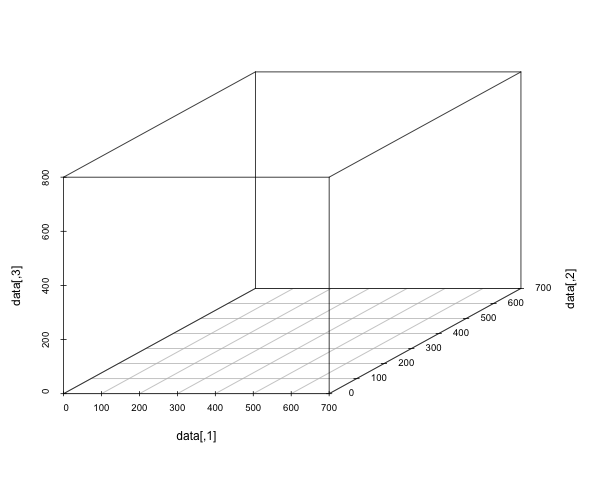

```{r setup, include=FALSE}
source("../R/utils.R")
knitr::opts_chunk$set(
  fig.align = "center",
  out.height = "380px",
  dpi = 180
)

include_graphics = function(name, ...){
  knitr::include_graphics(file.path("04-eigen", name), ...)
}
library(tidyverse)
```

```{r, cache=FALSE, echo=FALSE}
knitr::read_chunk("R/demo.R")
```

## 宿題 / Homework Assignment

HW05
Visit https://github.com/rokko-ed17q1/hw-portal

> Due 2017-04-30 18:00.
> Hand in by Pull Request.
> Read the handout for details!


---

## 本日の目標

* 種々の安定性概念を理解する
* 行列の固有値と安定性の関係を理解する

---

`r section("Recap")`

---

## 対角化

行列 $A$ の固有ベクトルを並べた行列 $V$ が正則であれば，

$$A = VDV^{-1}, \qquad D = V^{-1}AV$$
によって対角化できる

---

## べきの計算

対角化によって行列のべき乗 $A$ を計算できる

$$\begin{aligned}
A^n 
&= \left(
  VDV^{-1}
\right)^n \\
&= VD^nV^{-1}.
\end{aligned}$$

---

## Demo

```{r matrices}
```

---

## Demo

```{r, echo = FALSE}

```


---

`r section("Stability")`

---

## 自律的な動的システム

非線形システム

$$x_{t+1} = G(x_t)\quad \text{or} \quad x_t = G^t (x_0)$$

平衡点（steady state）

$$x^* = G(x^*)$$

自律的（autonomous）という言葉は，ここでは入力がない（no input）という意味


---

## Lyapunov Stability

平衡点 $x^*$ が Lyapunov 安定

$:\Longleftrightarrow \forall \epsilon > 0, \exists \delta > 0$
$$\| x_0 - x^*\| < \delta \Longrightarrow 
\| G^t(x_0) - x^* \| < \epsilon, \quad t = 1,2,\dots$$

$x^*$ の近くを出発すると， $x^*$ の近くにとどまり続ける

---

## Asymptotic Stability

平衡点 $x^*$ が漸近安定 ((locally) asymptotically stable)

$:\Longleftrightarrow \exists \delta > 0$
$$\| x_0 - x^*\| < \delta \Longrightarrow 
\| G^t(x_0) - x^* \| \to 0$$

平衡点の近くを出発すると，平衡点に収束する

---

## Exponential Stability 

平衡点 $x^*$ が指数安定 ((locally) exponentially stable)

$:\Longleftrightarrow \exists \alpha, \beta, \delta > 0$
$$\| x_0 - x^*\| < \delta \Longrightarrow 
\| G^t(x_0) - x^* \| < \alpha \| x_0 - x^* \|e^{-\beta t}$$

平衡点の近くを出発すると，平衡点に幾何級数より速く収束

The convergence is at least as fast as a geometric sequence.

---

## Linear Case

線形システム
$$x_{t+1} = Ax_t$$

の平衡点 $0$ は $A$ の固有値の絶対値がすべて1未満であれば指数安定。

$$\operatorname{sp} (A) \subset \mathbb D \Longrightarrow \text{Exponentially stable}$$

* $\operatorname{sp}(A) =$ $A$ の固有値の集合
* $\mathbb D = \{ z \in \mathbb C \mid |z| < 1 \}$ 

---

## Lyapunov Candidate Function

Real valued function $V$ with the following properties

* $V(x^*) = 0$,
* $V(x) > 0$ for $x \neq x^*$,
* $V(x_{t+1}) \le V(x_{t})$ along the trajectory $x_t = G^t(x_0)$.

If $G$ admits such a $V$, then $x^*$ is stable in the sense of Lyapunov.

If $V(x_{t+1}) < V(x_{t})$ is true for all $t$, $x^*$ is asmptotically stable.

---

## Lyapunov Theorem

Given a positive definite symmetric $Q$ (i.e., all the eigenvalues are positive), the following statements are equivalent. 

* Equation $A^\top P A - P + Q = 0$ admits a unique positive definite symmetric solution $P$.
* $A$ is a stable matrix (i.e., all the eigenvalues lie in the unit disk).

---

## Lyapunov Theorem

Notice that quadratic form $x^\top P x$ is a Lyapunov candidate function. 

In fact, 

$$\begin{aligned}
x_{t+1}^\top P x_{t+1} - x_t^\top P x_t 
&= x_t^\top (A^\top P A - P) x_t \\
&= - x_t^\top Q x_t \\
&< 0.
\end{aligned}$$


---

## Solve for $P$

Because we will use a similar argument later in this course, let's see how we can solve the Lyapunov equation. 

We will need 

* $\operatorname{vec}$
* $\otimes$

---

## $\operatorname{vec}$ operator (column stacking)

行列の各列を縦に積み上げる写像を $\operatorname{vec}:\mathbb{F}^{m\times n}\to\mathbb{F}^{mn}$ と書く。すなわち, 

$$\operatorname{vec}\left(\begin{bmatrix}a_{11} & \cdots & a_{1n}\\
\vdots & \ddots & \vdots\\
a_{m1} & \cdots & a_{mn}
\end{bmatrix}\right)=\begin{bmatrix}a_{11} \\ \vdots  \\ a_{m1} \\ \vdots\\ \vdots \\ a_{1n} \\ \vdots \\ a_{mn}\end{bmatrix}$$

---

## Fact

$$\operatorname{vec}(\alpha A + \beta B) = 
\alpha \operatorname{vec}(A) + \beta \operatorname{vec}(B),$$

where $A$ and $B$ are matrices of same size and $\alpha, \beta$ are scalars.

---

## Kronecker Product

$A\in\mathbb{F}^{m\times n}$ と $B\in\mathbb{F}^{p\times q}$ のKronecker積 $A\otimes B\in\mathbb{F}^{mp\times nq}$ を次のように定義

$$A\otimes B:=\begin{bmatrix}a_{11}B & \cdots & a_{1n}B\\
\vdots & \ddots & \vdots\\
a_{m1}B & \cdots & a_{mn}B
\end{bmatrix}$$

---

## Fact 1

Let $A, B, C$ be conformable matrices. 
$$\mathrm{vec}(ABC)=(C^{\top}\otimes A)\mathrm{vec}(B)$$ 

**Proof.**

$A\in\mathbb{F}^{m\times n}$, $B\in\mathbb{F}^{n\times p}$, $C\in\mathbb{F}^{p\times q}$. 

$$B=\begin{bmatrix}
B_{1} & \cdots & B_{p}
\end{bmatrix}, 
C=\begin{bmatrix}
C_{1} & \cdots & C_{q}\end{bmatrix}$$

とすれば

---

$$\begin{aligned}
\left(C^{\top}\otimes A\right)\mathrm{vec}(B)	
&=\begin{bmatrix}c_{11}A & \cdots & c_{p1}A\\
\vdots & \ddots & \vdots\\
c_{1q}A & \cdots & c_{pq}A
\end{bmatrix}\begin{bmatrix}B_{1}\\
\vdots\\
B_{p}
\end{bmatrix}\\
&=\begin{bmatrix}c_{11}AB_{1}+\cdots+c_{p1}AB_{p}\\
\vdots\\
c_{1q}AB_{1}+\cdots+c_{pq}AB_{p}
\end{bmatrix}\\
&=\begin{bmatrix}\begin{bmatrix}AB_{1} & \cdots & AB_{p}\end{bmatrix}C_{1}\\
\vdots\\
\begin{bmatrix}AB_{1} & \cdots & AB_{p}\end{bmatrix}C_{q}
\end{bmatrix}\\
&=\begin{bmatrix}ABC_{1}\\
\vdots\\
ABC_{q}
\end{bmatrix}=\mathrm{vec}(ABC)
\end{aligned}$$

---

## Fact 2

Let $A, B, C$ and $D$ be comformable. Then,

$$(A\otimes B)(C \otimes D) = (AC)\otimes (BD).$$

**Exercise.** Prove this fact. 

---

## Fact 3

Let matrices $A$ and $B$ have eigenvalues (incl. multiplicity)

$$\begin{aligned}
\operatorname{sp}(A) = \{ \lambda_1, \dots, \lambda_m \} \\
\operatorname{sp}(B) = \{ \omega_1, \dots, \omega_n \}.
\end{aligned}$$

It holds that 

$$\operatorname{sp}(A\otimes B) = \{\lambda_i \omega_j \mid 
1\le i \le m, \ 1 \le j \le n \}$$

**Proof.** Follows from Fact 2. 

---

## Discrete-time Sylvester Equation

Let $A, B, C$ be conformable, $I-\left(B^{\top}\otimes A\right)$ nonsingular. 

Matrix equation 

$$AXB-X+C=0$$ 

is solved by 

$$\mathrm{vec}(X)=\left[I-\left(B^{\top}\otimes A\right)\right]^{-1}\mathrm{vec}(C)$$

---

## Proof

Apply $\operatorname{vec}$ to $AXB - X + C = 0$ to get 

$$(B^\top \otimes A)\operatorname{vec}(X) - \operatorname{vec}(X) + \operatorname{vec}(C) = 0,$$
from which the fact follows immediately. 


Notice that you can reconstruct $X$ from $\operatorname{vec}(X)$. 


---

## Discrete-time Lyapunov Equation

Lyapunov equation

$$A^\top P A - P + Q = 0$$

is a special case of the Sylvester equation, which is solved by 

$$\operatorname{vec}(P) = (I - A^\top \otimes A^\top)^{-1} \operatorname{vec}(Q)$$

By Fact 3, 

$$\operatorname{sp}(A) \subset \mathbb D \Rightarrow 
\operatorname{sp}(A^\top \otimes A^\top) \subset \mathbb D$$

which implies that $I - A^\top \otimes A^\top$ is nonsingular. 

---

`r section('In continuous time')`

---

## Continous-time system

$$\dot x = Ax$$

The solution to the initial-value problem is given by

$$x(t) = e^{At} x(0),$$
where 

$$e^{At} = 
\sum_{k=0}^\infty \frac{t^k}{k!} A^k$$

---

## Diagonalizable $A$


$$\begin{aligned}
e^{At} &= 
\sum_{k=0}^\infty \frac{t^k}{k!} A^k = \sum_{k=0}^\infty \frac{t^k}{k!} VD^kV^{-1} \\
&= V\begin{bmatrix}
  \sum_{k=0}^\infty \frac{t^k}{k!} \lambda_1^k & & \\
  & \ddots & \\
  & & \sum_{k=0}^\infty \frac{t^k}{k!} \lambda_n^k
\end{bmatrix} V^{-1} \\
&= V\begin{bmatrix}
  e^{\lambda_1 t} & & \\
  & \ddots & \\
  & & e^{\lambda_n t}
\end{bmatrix} V^{-1}
\end{aligned}$$

---

## Stability in continuous-time models

Linear system $$\dot x = Ax$$ (or its zero) is exponentially stable if all the eigenvalues of $A$ lie in 

$$\mathbb C_- := \left\{
  z \in \mathbb C \mid \operatorname{Re}(z) < 0
\right\}$$

すべての固有値の実部が負なら指数安定

---

## 問題

$$A=\begin{bmatrix}
-3 & 1\\
1 & -3
\end{bmatrix}$$

(a) $e^{tA}$ を計算せよ  
(b) $\lim_{t\to\infty}e^{tA}$ を計算せよ


